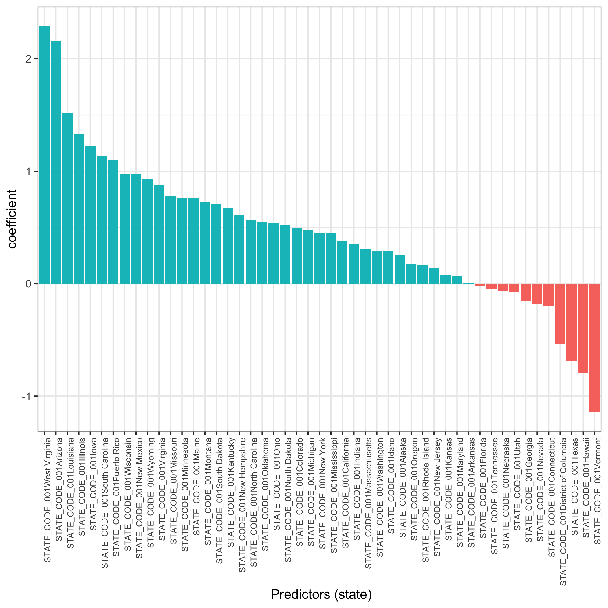
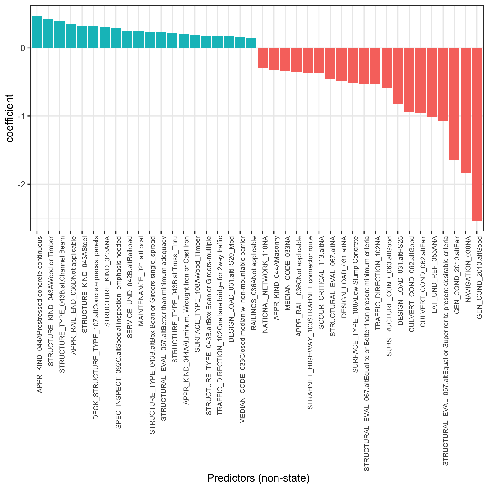
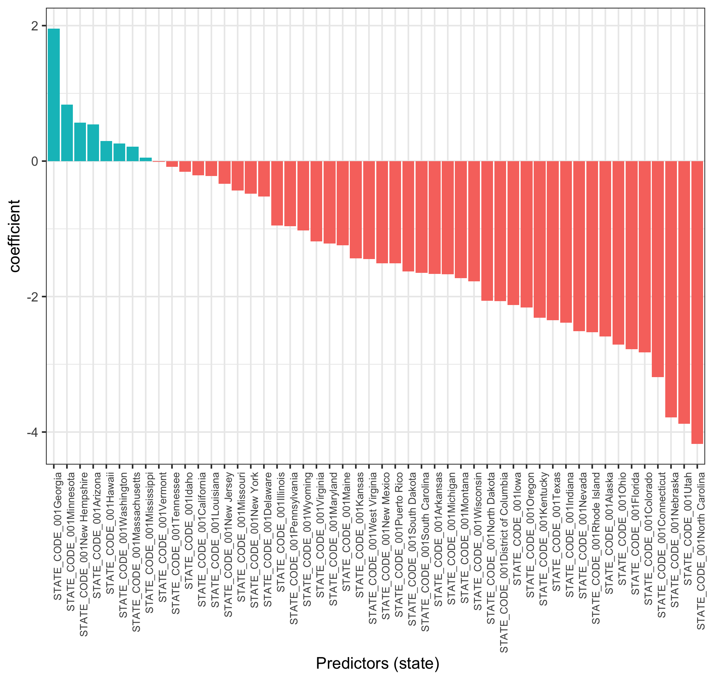
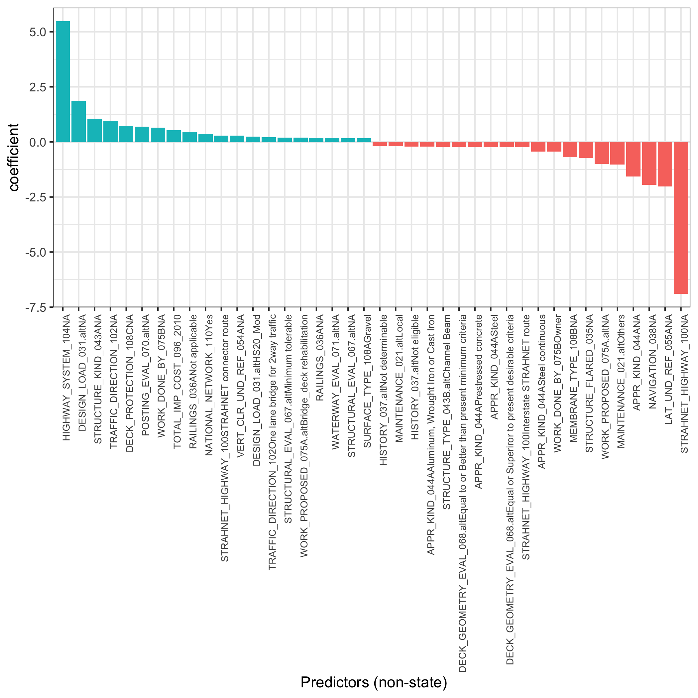

  
<script>
  $(document).ready(function() {
    $head = $('#header');
    $head.prepend('')
  });
</script>
  
```{r setup, include=FALSE}
library(ggplot2)
# set up a new base-theme for all plots 
theme_bw2<-theme_bw()+
  theme(# axis labels
    axis.title = element_text(size = 20),
    # tick labels
    axis.text = element_text(size = 20),
    # title 
    title = element_text(size = 20),
    legend.text=element_text(size=20)
  )
theme_set(theme_bw2)

knitr::opts_chunk$set(echo=FALSE, warning=FALSE, message=FALSE, fig.width=15, fig.height=9)
```

<br><br>
  
> Use case of bridge data analysis: Part II Analytics: Risk factors & Forecasts

# Structurally deficient structures
***

Plot % bridges in poor general condition (structurally deficient,SD) in 2010 and 2018

* States that show an increase in % of SD bridges are highlighted
* Percentages are marked on the bar

```{r}
 a<-tmp %>% 
  # group into 2 groups only
  mutate(GEN_COND.alt2=case_when(GEN_COND.alt=="Poor"~"SD",
                                 TRUE ~ "Non-SD")) %>%
  filter(Year %in% c(2010, 2018)) %>%
    group_by(Year,STATE_CODE_001,GEN_COND.alt2) %>%  
    # freq by year , state and gen condition
    mutate(s1=n()) %>%
    ungroup() %>%
    # freq by year over all conditions
    group_by(Year,STATE_CODE_001) %>%
    mutate(s2=n(),
           frq=s1/s2*100) %>%
    ungroup() %>%
  # focus only on the pct of poor condition
  filter(GEN_COND.alt2=="SD") %>%
    distinct(Year,STATE_CODE_001,.keep_all = T)
  
# highlight stacked bars where 2018 % is higher than 2010 % (use alpha feature)
a<- a %>% group_by(STATE_CODE_001) %>%
  arrange(Year) %>%
  mutate(frq.2010=first(frq),
         diff=frq-frq.2010,
         hl=any(diff>0)) %>%
  ungroup()

  ggplot(a, aes(x = reorder(STATE_CODE_001,-frq),y = frq, label=round(frq,0),
                   fill=as.factor(Year), alpha=hl!=T)) + 
    geom_bar(stat="identity",position="stack")+
    scale_y_continuous(breaks=pretty_breaks())+
    labs(x = "State", y = "% of structurally deficient (SD) structures",
         fill="Year")+
    scale_alpha_manual(values=c(1, 0.5)) +
    guides(alpha=F)+
    geom_text(size=3,position = position_stack(vjust=0.5))+
    theme(axis.text.x = element_text(angle=90,vjust=0))
```

# Risk factors
***

<div class="alert alert-info">
  <strong>Question:</strong> What structure-specific risk factors in 2010 are most predictive of **OUTCOME** in 2018?
</div>

* For all models, training data = 2010-2017, test data = 2018.
* Different outcomes could be included.
* Influential predictors are ranked: variables with large absolute values are the most influential.
* Blue (Red) = push up (down) the likelihood of future poor condition.
* Coefficients are for standardized predictors - used for ranking, not for interpretation. 


> The following analytics used advanced statistical modelling. 
> Machine learning methods yield little gain on the already excellent performance & are at huge computational cost.


## Outcome: Structural deficiency in 2018 {.tabset .tabset-pills .tabset-fade}

### Risk factor: states {.unlisted .unnumbered}

* 52 states
* Blue (Red) = push up (down) the likelihood of future poor condition.
* The higher the bar in absolute values, the stronger the influence

```{r}

```

### Risk factor: bridge features {.unlisted .unnumbered}

* 220 features (after spreading each category into a dummy) auto-scanned
* List the top 20 features that push up (blue) or down (red) the likelihood of a poor condition in 2018
* The higher the bar in absolute values, the stronger the influence

```{r}

```

### Model fit {.unlisted .unnumbered}

* NB: Reference level for [AUC] area under Receiver Operating Characteristic (ROC) curve = 0.50 (random prediction), with values > 0.8 regarded as good discrimination.

```
Training data performance
```

* [AUC] area under Receiver Operating Characteristic (ROC) curve = `r round(a.GEN_COND$auc[1],2)`
* Percent correctly predicted = `r round((b.GEN_COND[2,2]+b.GEN_COND[1,1])/sum(b.GEN_COND)*100,0)` %

```
Test data performance (2018)
```

* [AUC] area under Receiver Operating Characteristic (ROC) curve = `r round(a.GEN_COND2,2)`
* Percent correctly predicted = `r round((b.GEN_COND2[2,2]+b.GEN_COND2[1,1])/sum(b.GEN_COND2)*100,0)` %

## Outcome: Total cost in 2018 {.tabset .tabset-pills .tabset-fade}

### Risk factor: states {.unlisted .unnumbered}

* 52 states
* Blue (Red) = push up (down) the likelihood of future poor condition.
* The higher the bar in absolute values, the stronger the influence

```{r}

```

### Risk factor: bridge features {.unlisted .unnumbered}

* 220 features (after spreading each category into a dummy) auto-scanned
* List the top 20 features that push up (blue) or down (red) the likelihood of a poor condition in 2018
* The higher the bar in absolute values, the stronger the influence

```{r}

```

### Model fit {.unlisted .unnumbered}

```
Training data performance
```

* R-squared = `r round(a.COST,2)`

```
Test data performance (2018)
```

* R-squared = `r round(a.COST2,2)`


# Forecasts 

* Forecasting requires the advanced use of analytics, and is the core for predictive maintenance.
* Each question requires a **bespoke** approach. 
* List of potential questions we can explore:

```
Asset owner level
```

1. Which 10 states will have highest total cost (in 2, 4, 8 years)

2. In each state, which 10 bridges will have highest total cost (in 2, 4, 8 years)

3. In each state, which 10 bridges will have highest prob. of dropping a category (in 2, 4, 8 years)

4. In each state, which 10 bridges will have highest risk of becoming structurally deficient (in 2, 4, 8 years)

```
Specific asset level
```

 1. For a given bridge with fair/good status, when would it become structurally deficient?
 
 2. For a given bridge, what is the cost estimate over time?

